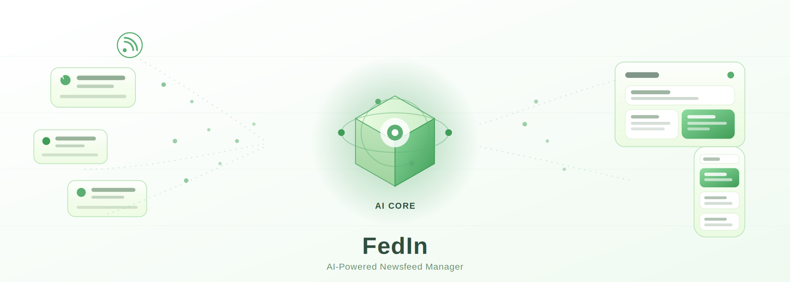
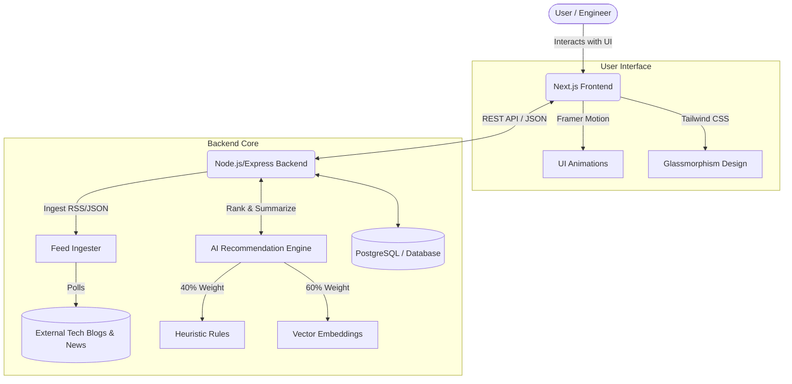

<p align="center">
  
</p>

# FedIn - AI-Powered Newsfeed Manager

FedIn (formerly Stratum) is a personalized, AI-powered technology newsfeed manager built for engineers. It aggregates, ranks, and summarizes the latest articles from multiple sources, allowing you to stay ahead of the curve without the cognitive overload.

## 🌟 Features
- **Smart Personalization:** Utilizes a hybrid recommendation engine (Rules-based + Vector Embeddings) to prioritize content relevant to your reading habits.
- **AI Summaries:** Automatically generates quick, concise takeaways for long articles.
- **Minimalist UI:** A sleek, beautiful frontend built with Next.js, Tailwind CSS, and Framer Motion featuring a custom "Glass on Green" aesthetic.
- **Real-time Updates:** Ingests feeds constantly to ensure you never miss breaking tech stories.

## 🏗 Architecture Overview

The application is split into a modern Next.js frontend and a Node.js backend that handles feed ingestion, AI processing, and user data.



## 🚀 Tech Stack

- **Frontend:** Next.js (App Router), React, Tailwind CSS, Framer Motion, Phosphor Icons
- **Backend:** Node.js, Express.js
- **Design System:** Custom CSS variables for a cohesive `fedin-green` and frosted glass theme.

## 🛠 Getting Started

### Prerequisites
- Node.js (v18 or higher)
- npm or yarn

### Installation
1. Clone the repository.
2. Install frontend dependencies:
   ```bash
   cd frontend
   npm install
   ```
3. Install backend dependencies:
   ```bash
   cd backend
   npm install
   ```

### Running Locally
You will need to start both the frontend and backend servers to run the full application.

**Start the Frontend:**
```bash
cd frontend
npm run dev
# Runs on http://localhost:3000
```

**Start the Backend:**
```bash
cd backend
npm run dev
# Runs on configured backend port
```
